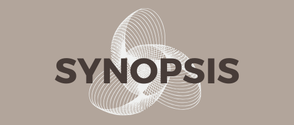

# SYNOPSIS
SYNOPSIS, Gemini AI kullanılarak geliştirilmiş bir mobil uygulamadır. 

## Problem
Öğrenciler, dersler sırasında öğretmenin hızlı anlatımı veya konsantrasyon kaybı nedeniyle önemli bilgileri not alma konusunda zorluk yaşayabilmektedirler. Ayrıca, katılamadıkları veya tekrar gözden geçirmek istedikleri derslerin ses kayıtlarını dinleyerek ilerlemek durumunda kalmaktadırlar. Ancak, bu kayıtlar genellikle uzun süreli olmaktadır ve tüm kaydı baştan dinleyip not almaları, dersle ilgili olmayan kısımların da bulunması gibi etkenler de göz önünde bulundurulduğunda, ciddi zaman kayıplarına neden olmaktadır.

## Amaç
Mobil uygulamaya yüklenilen ve uygulama tarafından kaydedilen ders ses kayıtlarının Gemini AI tarafından analiz edilip özetlerinin çıkarılması ile:
- Öğrencilerin vakit kaybının önüne geçilmesi,
- Ders içeriğinin daha özlü ve anlaşılır bir biçimde not halinde sunulması,
- Sınav tarihleri gibi önemli tarihlerin kaydedilmesi,
- Dersi ya da ses kaydını dinlerken önemli kısımların gözden kaçması yada unutulmasının önlenmesi hedeflenmiştir.

## Uygulama Özellikleri
- Gemini AI entegrasyonu ile uygulama, yüklenilen dosyanın ilk olarak analiz edilebilir bir ses dosyası ya da bir eğitim içeriği olup olmadığını kontrol eder. Eğer bu kriterler sağlanmazsa kullanıcıya ses dosyasının içeriğinin uygun olmadığı ve işlemin başarısız olduğu hakkında bir bilgi döner. Analiz işlemi gerçekleşmez.
- Yüklenilen ses dosyası istenilen kriterleri sağlar ise Gemini AI ses dosyasını analiz eder. Ana konu, anahtar kelimeler, belirtilen önemli konseptler, tarihler vb. kriterlere dikkat edilerek Gemini AI tarafından analiz işlemi gerçekleştirilir.
- Kullanıcıların ihtiyaçlarına uygun klasörler oluşturarak içeriklerini düzenleyebilmesi ve oluşan özetlerin kolay erişilebilirliğinin sağlanması amacıyla klasör yapısı tanımlanmıştır. Örnek olarak kullanıcı, Math101 dersinin özetlerini bu derse ait bir klasör oluşturarak, oluşturulan klasör altında tutabilmektedir.
- AI modeli kendini geliştirebilen bir teknoloji olduğu için, kullanıcının; yüklediği ses dosyası için birden fazla analiz yaptırabilmesine olanak sağlanmıştır. Bu analizlere Results ekranından erişilebilmekte olup listeden istediği sonucu görüntüleyebilmektedir.
- Yüklenilen ses dosyası hangi dilde olursa olsun çıkarılan özet istenilen dilde olmaktadır. Yani yüklenilen ses dosyasının içerdiği dil fark etmeksizin sonuç için istenilen dilde özetler elde edilebilmektedir.
  
**Kullanılan Teknolojiler:** Gemini AI, React-Native Expo, Firebase(Authentication, FireStore Database, Storage)

## Developers
- Beyza Nur Gören
- Yağmur Akbaba

